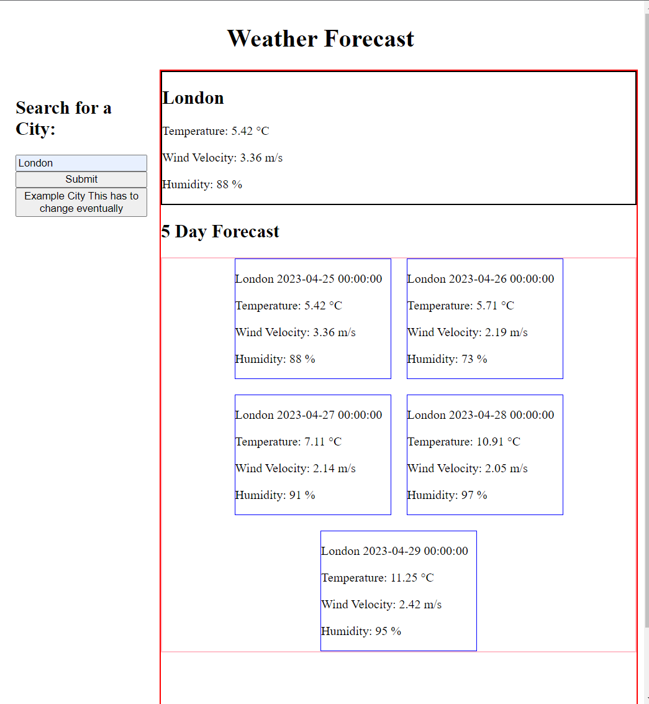

# Weather Dashboard

## Description

This is a Web Application that allows the user to look up a city and have displayed the current weather conditions as well as the future weather conditions for the following 5 days

## Installation

N/A

## Usage

Write the city that you want to look up in the search bar and click the submit button, the web-page should save that query in a button, if you want to look for that city again but dont want to type

Here is how it looks:

You can visit the website here: 

https://alejandro-jpeg.github.io/Weather-Forecast/

## Credits

N/A

## License

N/A